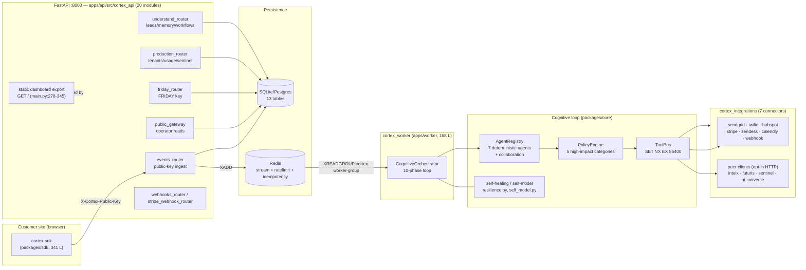
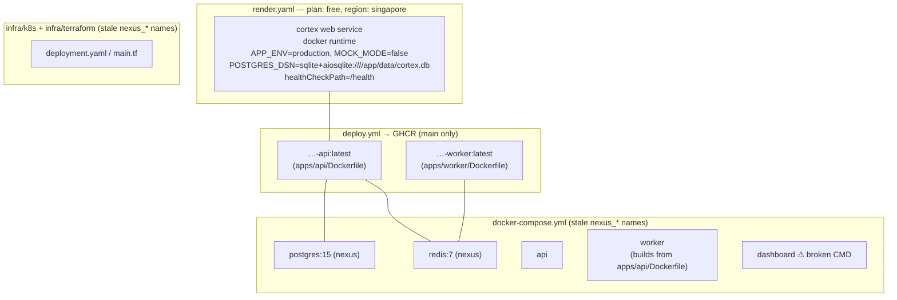

# CORTEX — Repository Comprehension Report

**Repository:** `surendra2304/Cortex` @ `83e6f9a7260743166c8477ea6a602929447149c1` (merge of PR #1, `arena/01a10cc3-cortex`), shallow clone (1 commit)
**Report date:** 2026-10-07 (UTC) · **Analyst:** Arena.ai Agent Mode · **Session branch:** `arena/998f44c2-cortex`
**Deliverables:** this file + per-phase notes in `notes/phase0_orientation.md` … `notes/phase15_synthesis.md`

**Method & labeling.** Every claim is cited `path:line` and labeled **[FACT]** (read in source or executed this session), **[INFERENCE]** (reasoned from evidence), or **[HYPOTHESIS]** (unverified guess). Execution over reading: I built the environment, ran the full test suite, both linters, `pip-audit`/`npm audit`, the SDK and dashboard builds, booted the API + a dev Redis double, probed the live HTTP surface (including reproducing a cross-tenant IDOR), booted the worker, and ran the repo's own pressure harness (9/9 PASS). The work was non-destructive: no source file was modified, nothing was committed/pushed/published, and the one accidental regeneration of the committed `apps/dashboard/out/` was restored (`git status --porcelain` → empty at report time).

---

## Executive Summary

CORTEX v2.0.0 is a ~6-week-old Python/TypeScript **monorepo** implementing an "autonomous web operations intelligence platform" — the governed website-operations specialist of the FRIDAY agent ecosystem. It combines: a **FastAPI** service (75 OpenAPI paths) for telemetry ingestion + operator APIs, a **Redis-stream worker** running a 10-phase cognitive loop over 7 deterministic specialist agents, a **policy/approval engine** gating high-impact actions, 7 outbound business connectors (SendGrid, Twilio, HubSpot, Stripe, Zendesk, Calendly, webhooks), opt-in peer integrations (IntelX, Futuris, Sentinel, AI Universe), a **Next.js 14 dashboard** (static export, served by the API itself), a **browser SDK**, and a 23-module `cortex_upgrade` hardening layer with its own test suite.

**Verification results (this session):** 339 tests passed / 1 failed / 3 skipped (failure root-caused as order-dependent, not a code regression) · ruff + flake8 clean · pip-audit: 3 advisories in 2 packages (one mitigated by pinned JWT algorithms) · npm audit: 9 advisories (mostly unreachable in the static export) · SDK build + typecheck clean · dashboard build succeeds (17 static pages) · live API: ingestion, auth, rate limiting, idempotency, cognitive loop all verified over HTTP · pressure harness **9/9 PASS** (~95-111 events/s at concurrency 50 on SQLite, p50 ≈ 315 ms).

**Headline security finding (live-confirmed CRITICAL):** `GET /v1/visitors/{id}` and `GET /v1/leads/{id}` (`apps/api/src/cortex_api/public_gateway.py:77,119`) have **no tenant filter** — a JWT for `tenant_attacker` (even role `cortex_viewer`) reads another tenant's visitor profile **including email**, and leads. Related unscoped reads exist in `friday_router.py` (`/priority_leads` returns cross-tenant `profile_email`; `/incidents` returns `raw_data`) and in the orchestrator's Contextualize phase. Additionally, any `cortex_admin` can mint ingestion keys for **any** tenant (`POST /v1/api-keys`, `main.py:215`), dev mode is **unauthenticated-admin by default** (`MOCK_MODE=true` ⇒ `DEV_AUTH_BYPASS`, empty HS256 secret), and `POST /v1/tenants` returns the tenant's `operator_jwt_secret` in plaintext (`production_router.py:582-592`).

**Engineering quality is high** (defect-ID-referenced regression tests, honest-failure design, clean lint, fast suite, real pressure harness) but **operational maturity is partial**: unpinned dependency floors (already caused a redis-py 8.x worker breakage against the bundled dev double), a broken dashboard Dockerfile (`next start` vs `output: export` — executed), free-tier SQLite on Render, stale `nexus_*` naming in compose/k8s/terraform, committed build artifacts (`apps/dashboard/out/`), CI "lint"/"scan" jobs that don't lint and don't block, and duplicated hardening stacks (`cortex_upgrade/` vs `packages/*`).

---

## Phase 0 — Orientation & Ground Truth

- Repo: `surendra2304/Cortex`, HEAD `83e6f9a` = merge of PR #1 (`arena/01a10cc3-cortex`), author Surendra, 2026-10-07 00:46 +0530. **Shallow clone — 1 commit, 482 objects** (`git rev-parse --is-shallow-repository` → true; `git log` shows only the merge). [FACT]
- Identity: CORTEX v2.0.0 (`pyproject.toml`), hatchling monorepo (`name = "cortex-monorepo"`); self-described as "autonomous operational intelligence substrate (FRIDAY is the general OS above it)" (`packages/core/src/cortex_core/self_model.py:274-277`). [FACT]
- Layout: `apps/api` (FastAPI, 20 modules, ~6.9 k LOC) · `apps/worker` (168 LOC) · `apps/dashboard` (Next.js, `src/` ~649 LOC + committed `out/`) · `packages/*/src/cortex_*/` (12 Python packages) + `packages/sdk` (TS) · `cortex_upgrade/` (23 modules, ~1.8 k LOC) · `tests/` (84 files, 339 test functions) · `scripts/` · `infra/` (alembic ×5, k8s, terraform) · `migrations/` (1 SQL file) · `docs/`, `diary/` (10 dated files), `patches/peer_fixes/` (2), `examples/`. [FACT]
- Prior-agent artifacts in the repo root (`AUDIT_REPORT.md`, `AGENT_BRAIN_2026-10-06.md`, `CORTEX_DIARY.md`, `PHASE0-2_AUDIT_2026-10-05.md`, `PHASE5_HANDOFF_2026-10-05.md`, `SYSTEM_MANIFEST.md`) were treated as **claims, not truth**. Their defect lists describe the pre-fix state; the current HEAD contains the fixes (spot-verified: tenant-scoped event reads `events_router.py:362-393`, WS auth `ws_auth.py`, observation-based self-model `self_model.py`, real GDPR erasure `privacy.py:96-213`). Their quantitative claims are stale: README "307 tests", `docs/DEPLOYMENT.md` "128 tests", diary "128 tests" — actual: **339 test functions / 343 collected items**. [FACT]

## Phase 1 — Stack & Dependency Fingerprint

**Toolchain [FACT]:** Python 3.11 (3.11.2 sandbox; pinned 3.11 in both workflows; `requires-python = ">=3.11"`), Node 22.22.3/npm 10.9.8 sandbox vs Node 20 in CI and `node:20-alpine` in the dashboard Dockerfile. Ruff (line-length 120, select E,F,W,I,B,UP) + flake8 (`.flake8`); black in dev deps but not CI-enforced. `.python-version` is garbled (likely UTF-16) — cosmetic, unverified.

**Python deps [FACT]:** `requirements.txt` = 21 packages, **all unpinned floors** (`>=`): fastapi, uvicorn[standard], pydantic, pydantic-settings, redis, asyncpg, sqlalchemy[asyncio], aiosqlite, alembic, httpx, sendgrid, twilio, hubspot-api-client, stripe, python-jose[cryptography], aiohttp, python-dotenv, prometheus-client, jinja2. Resolved redis-py = **8.1.0**.

**pip-audit [FACT, executed]:** 3 known vulnerabilities in 2 packages:

| Package | Version | Advisory | Impact | Mitigation in this codebase |
| :--- | :--- | :--- | :--- | :--- |
| python-jose | 3.5.0 | CVE-2026-85394 | Incomplete fix for CVE-2024-33663 — DER-encoded keys accepted in HMAC init → HS256 forgery if algorithms unrestricted | **Mitigated**: every `jwt.decode` pins algorithms — `auth.py:169` (`["RS256"]`), `auth.py:183` + `ws_auth.py:87` (`["HS256"]`) |
| ecdsa | 0.19.2 | PYSEC-2026-1325 (×2) | Minerva timing attack on P-256 (`sign_digest`); upstream considers side channels out of scope, no fix planned | Low residual: used only on verify paths; still an unpinned floor |

**TypeScript deps [FACT]:** root `package.json` = npm workspaces; `package-lock.json` v3 pins **next 14.2.35**, react 18.3.1, 17 platform-specific optional deps. `npm ci` succeeds at root and per-workspace (exit 0) — the prior audit's "npm ci cannot install" claim is **stale/not reproducible**. **npm audit: 9 vulnerabilities (1 critical, 6 high, 2 moderate)** — next 14.2.35 (critical: image-optimizer AVIF RCE + RSC/DoS/SSRF/cache-poisoning ranges), braces, chokidar, fast-glob, micromatch, postcss, tailwindcss (high), postcss-nested, postcss-selector-parser (moderate). **Mitigations [FACT]:** `next.config.js` sets `output: 'export'` + `images.unoptimized: true`; the shipped artifact is a pure static export with no Server Actions/middleware/rewrites/image-optimizer — the flagged server-side CVE classes are not reachable in production; the rest are build-time-only deps.

## Phase 2 — Architecture Mapping

### Component map

### Cognitive loop (per event, in the worker)

```mermaid
flowchart LR
    A["1 Observe"] --> B["2 Contextualize<br/>(⚠ unscoped lookups)"]
    B --> C["3 Understand<br/>intent classification"]
    C --> D["4 Plan<br/>deterministic agent;<br/>AI Universe only if<br/>AMBIGUOUS/STRATEGIC"]
    D --> E["4a Collaborate<br/>bounded handoffs,<br/>consensus, dissent"]
    E --> F["5 Authorize<br/>PolicyEngine"]
    F --> G["6 Execute<br/>ToolBus idempotency"]
    G --> H["7 Verify<br/>honest 'executed'"]
    H --> I["8 Measure"]
    I --> J["9 Learn<br/>redacted audit + memory"]
    J --> K["10 Continue"]
```

### Deployment topology (as configured)

**Architectural invariants [FACT]:** tenant identity only from the credential (`events_router.py:196-202`); recommendation ≠ authorization (5-phase governed operations); honest deterministic fallback (never laundered as AI output); honest tool verification; bounded collaboration (no capability transfer, cycle refusal); allow-listed reversible self-modification. **Smells [INFERENCE]:** duplicated hardening stacks (`cortex_upgrade` vs `packages/*`); `cortex_analytics/outcomes.py:6` imports `cortex_api.db_models` (package→app inversion); committed build artifacts served as the production dashboard.

## Phase 3 — Entry Points & Configuration Inventory

| Entry | Command | Status [FACT] |
| :--- | :--- | :--- |
| API (dev) | `python scripts/run_api.py --port 8000` | works (used live) |
| API (container) | `uvicorn cortex_api.main:app --host 0.0.0.0 --port ${PORT:-8000}` | root + `apps/api/Dockerfile` CMD |
| Worker | `python -m cortex_worker.main` | boots; broken vs dev Redis double (V16) |
| Dashboard | static export served by API at `/`, `/dashboard` | works (`main.py:278-345`, traversal-contained) |
| Dashboard (dev) | `npm run dev` | works |
| Dashboard (container) | `npm start` | **fails: `next start` does not work with `output: export`** (executed) |
| SDK | tsup CJS/ESM/IIFE + d.ts | builds clean |
| CI | pytest + `npm run build` ×2 + advisory-only audits | `.github/workflows/ci.yml` |
| Deploy | GHCR api/worker images on main; Render from `render.yaml` | `deploy.yml` |

Fresh-shell gotcha [FACT]: importing `cortex_*` requires `PYTHONPATH` over `apps/*/src` + `packages/*/src` (Docker images set it; a bare shell doesn't).

**Config inventory [FACT]** (`config.py` + `.env.example`): `APP_ENV` (default `development`; `production`/`RENDER=1` disables bypass) · `MOCK_MODE` (**default `true`** ⇒ `DEV_AUTH_BYPASS`: synthetic `cortex_admin`/`tenant_default` for unauthenticated requests, `auth.py:31-44,120`) · `CORTEX_DEV_AUTH_BYPASS` (opt-out) · `POSTGRES_DSN` (**the variable the code reads**; default `sqlite+aiosqlite:///./data/cortex.db`; `DATABASE_URL` is dead app config, still used by alembic/compose) · `REDIS_URL` (+ stream `cortex:events:stream`, group `cortex-worker-group`) · `JWT_SECRET` (empty in dev → HS256 with empty secret verifies; prod requires ≥32 chars, `INSECURE_DEFAULTS` blocklist) · `OIDC_JWKS_URL/ISSUER/AUDIENCE` (RS256 path) · `FRIDAY_API_KEY` (`hmac.compare_digest`) · `CORTEX_PII_SALT` (required by `hash_pii`) · `RATE_LIMIT_MAX_REQUESTS/WINDOW_SECONDS` (1000/60 s per key+site) · connector creds (`SENDGRID_*`, `TWILIO_*`, `HUBSPOT_API_KEY`, `STRIPE_*`, `ZENDESK_*`, `CALENDLY_API_KEY`) — absent ⇒ MOCK in dev, DISABLED (fail-closed) in prod · peer URLs (`INTELX_BASE_URL`, `FUTURIS_BASE_URL`, `SENTINEL_BASE_URL`, `AI_UNIVERSE_BASE_URL`) — opt-in, else deterministic fallback · `DASHBOARD_DIR` · `NEXT_PUBLIC_CORTEX_API_URL`, `NEXT_PUBLIC_OPERATOR_TOKEN`.

**Committed-credential hygiene [FACT]:** no `.env`/key material tracked (`git ls-files` clean). But `.env.example` ships default-looking credentials (`CORTEX_API_KEY=cortex_api`, `FRIDAY_API_KEY=friday_api`, peer keys `intelx_api`/`futuris_api`/…, `NEXT_PUBLIC_OPERATOR_TOKEN=mock_operator_jwt_token_123`) and live Render URLs — a pattern that invites real secrets into the same slot. **No committed secrets found.**

## Phase 4 — Data Model

**13 ORM tables [FACT]** (`apps/api/src/cortex_api/db_models.py`): `profiles` (:21), `visitors` (:36), `sessions` (:50), `events` (:67), `leads` (:95), `audit_records` (:110), `api_keys` (:124, SHA-256 hash + prefix only), `identity_links` (:138), `lead_scores` (:152), `memory_entries` (:168), `workflow_runs` (:183), `approval_queue` (:197), `strategy_performance` (:217). Every table carries `tenant_id`; reads filter by it (exceptions in Phase 10). **Schema management [FACT]:** dev auto-`create_all` + dev-key provisioning; prod via alembic (`infra/alembic/`, 5 versions covering all 13 tables, `env.py` reads `DATABASE_URL`/`POSTGRES_DSN`); `migrations/001_create_events_and_sessions.sql` (raw SQL, 2 tables). Default = SQLite; Postgres via asyncpg. render.yaml runs **free-tier SQLite on ephemeral disk** → data loss on restart [INFERENCE]. **Redis [FACT]:** event stream, per-key+site sliding-window limiter with atomic fallback, ToolBus idempotency (`SET NX EX 86400`), event dedupe store. **Privacy [FACT]:** `SecretScrubber` regex masking before logs/AI/exports (`policy_engine/privacy.py:22-64`); salted SHA-256 `hash_pii` (salt required); GDPR Art. 15 export + Art. 17 cascading hard erasure over 8 tables with real row counts (`privacy.py:96-213`).

## Phase 5 — Core-Flow Deep Reads

- **Ingestion [FACT, live-verified]:** public-key SHA-256 lookup (fail-closed 503) → tenant derived only from credential (payload tenant rejected unless neutral, `events_router.py:43-46,167-202`) → 429 rate limit → dedupe (`{"status":"duplicate"}`) → DB insert (prod fails closed) → `XADD` to stream. 256 KiB cap → 413.
- **Cognitive loop [FACT, live-verified via `/v1/friday/command`]:** 10 phases as diagrammed; deterministic agents first, AI Universe only for AMBIGUOUS/STRATEGIC with honest `NOOP_FALLBACK`; bounded collaboration (handoffs carry no capability, max rounds/agents, cycle refusal, dissent recorded); PolicyEngine authorization (5 high-impact categories, DANGEROUS always blocked); ToolBus execution with Redis idempotency and honest verification; redacted audit + tenant-scoped strategy memory in Learn. **Gap [FACT]:** Contextualize resolves Visitor/Profile/Lead by id without tenant filter.
- **Agents [FACT]:** 7 deterministic specialists (growth, sales, support, reliability, qualification, churn_risk, competitive — the last proposes IntelX battlecards at hardcoded confidence 0.92) + collaboration (confidence-weighted consensus).
- **Policy/privacy [FACT]:** 5 high-impact categories; approval queue terminal decisions (409 on re-decide); SENSITIVE auto-approved; explicit approval dict bypasses category checks; mock connectors claim `verified:true`.
- **Self-healing/self-model [FACT, live-verified]:** circuit breakers (3 failures or ≥0.6 ratio over ≥5 samples, 15 s recovery), supervisor with repair cooldown + escalation; self-model reports only observed state (`/v1/friday/self_model` live: `tool_execution: unverified` + gap, `ai_universe_deliberation: degraded`, DB-counted usage); self-modification allow-listed to 3 reversible knobs with rollback + history.
- **Workflows/identity/analytics/intelligence/memory [FACT]:** workflow state machine + lead-nurture/security-incident/capacity-planning; identity resolution via `identity_links`; funnel/cohorts/experiments (two-proportion z-test, sticky variants)/attribution/outcome-learning (PROVEN >60% n≥20, DEMOTED <30% n≥10)/NL-query/security-baseline; exposure monitor, market signals, predictive personalization; tenant-scoped memory. Peer clients (`intelx_client` 393 L, `futuris_client` 342 L, `sentinel_client` 221 L, `peer_transport.py`) are opt-in, read-only, and label every result `source: peer|fallback` with `degraded` reasons. `landing_page.py` = a 797-line static HTML/JS constant (marketing page + loop simulator).
- **cortex_upgrade [FACT]:** 23 hardening modules + `tests/upgrade/` (19 unittest-style files) — a parallel implementation of policy/toolbus/approval/memory concepts (see tech debt).

## Phase 6 — API Surface

**75 OpenAPI paths + 1 WebSocket (`/v1/ws/events`) + non-schema routes (`/`, `/dashboard`, `/docs`) [FACT, live dump].**

| Tag | # | Auth | Notable |
| :--- | :--- | :--- | :--- |
| Event Gateway | 2 | public key | `POST /v1/events`, `/v1/events/batch` |
| Public API Gateway | 9 | operator JWT | `GET /v1/leads`, `GET /v1/leads/{id}` ⚠, `GET /v1/visitors/{id}` ⚠, analytics/audit/agents/identify/workflows |
| Understand Layer | 14 | operator JWT | lead scores, visitor profiles, memory, identity, approvals, workflow runs, funnels/cohorts/attribution |
| FRIDAY Integration | 22 | FRIDAY key | `command`, `task`, `collaborate`, `self_model`(+diagnose/modify), `self_healing`(+run), `priority_leads` ⚠, `incidents` ⚠, `connectors/health`, `properties`, `outbound/request`, task cancel/rollback/status |
| Production & Observability | 22 | mixed | `/health`, `/health/ready`, `/metrics`, `POST /v1/tenants` ⚠ (plaintext `operator_jwt_secret`, `production_router.py:582-592`), tenant usage/settings, `/connectors` ⚠ (hardcoded HEALTHY), sentinel/predictive/security/privacy endpoints |
| Stripe Webhooks | 1 | signature | `POST /v1/webhooks/stripe` |
| Webhooks | 1 | provider secret | `POST /v1/webhooks/{provider}` ⚠ (missing secret accepted with `signature_verified:false` in dev) |
| Administration | 1 | admin JWT | `POST/GET /v1/api-keys` ⚠ (tenant_id from body, no caller-tenant check, `main.py:215-238`) |
| System / Task Protocol | 3 | none / FRIDAY | `/`, `/v1/health`, `POST /v1/task/execute` |

**Auth model [FACT]:** operator JWT (RS256/JWKS or HS256; roles viewer < operator < admin + `friday_system`) · FRIDAY key (`X-Friday-Api-Key`, constant-time compare) · public key for ingestion · WS mirrors JWT (close 1008) · `DEV_AUTH_BYPASS` in non-prod with `MOCK_MODE=true` (default) — live-verified: unauthenticated requests become synthetic admin; the mock token `mock_operator_jwt_token_123` and HS256-with-empty-secret tokens verify in dev. **Cross-cutting [FACT, live]:** `/health` UP · `/health/ready` READY (required deps only; optional peers degrade) · `/metrics` Prometheus · `GET /` serves dashboard HTML or JSON health by `Accept` · ingestion edge cases 401/403/413/429/duplicate all verified.

## Phase 7 — Frontend

- **Dashboard [FACT]:** Next.js 14.2.35, React 18.3.1, app router, TS, Tailwind; `output: 'export'`, `trailingSlash`, `images.unoptimized`. **17 pages; only 3 are linked in the Sidebar (Overview/Leads/Activity) and 13 of 17 are 5-line `ModuleStatus` stubs.** `src/lib/api.ts`: relative baseURL, Bearer from `localStorage["cortex_operator_token"]`, `CredentialControl` token UI. First Load JS 87-116 kB/page. **Build succeeds (~26 s) [FACT]; `npm ci` works [FACT].**
- **Committed static export `apps/dashboard/out/` [FACT]:** tracked in git; a rebuild churns **81 tracked files** (chunk-hash drift) — restored after my verification build. The API serves it at `/` (`main.py:278-345`).
- **Broken container path [FACT, executed]:** `apps/dashboard/Dockerfile` `CMD ["npm","start"]` → `next start` aborts (`"output: export"`); the compose `dashboard` service would crash-loop and passes a stale `NEXT_PUBLIC_NEXUS_API_URL`.
- **npm audit [FACT]:** 9 advisories (see Phase 1) — mostly unreachable in the static export.
- **SDK [FACT]:** 341-line `packages/sdk/src/index.ts`; consent defaults false; queue/batch/retry-backoff with single-POST fallback; `X-Cortex-Public-Key`; 30-min sessions; UTM + auto `page_view`; tsup build + `tsc --noEmit` clean.
- **Assessment [INFERENCE]:** a thin, partially stubbed operator console over a rich API; the committed export is the production artifact; the Dockerfile path never worked as written.

## Phase 8 — Testing & CI

- **`pytest tests -q` → 339 passed, 1 failed, 3 skipped (26.3 s) [FACT].** 84 files / 339 test functions (218 sync + 121 async): `tests/unit` 45 files/248, `tests/integration` 19/36, `tests/upgrade` 19/37 (unittest style, targets `cortex_upgrade`), `tests/test_prompt9_cortex.py` 18. `conftest.py`: file-backed SQLite + FakeRedis + dependency overrides + autouse `DEV_AUTH_BYPASS=False`.
- **The 1 failure [FACT, root-caused]:** `test_futuris_predictive_api_endpoints` builds `TestClient(app)` without conftest overrides → hits the module-level engine at repo `data/cortex.db`, empty on fresh checkout → `no such table: events`. Proven order-dependent (passes after API boot creates schema; fails again after deleting the DB). Test-isolation defect, not a code regression.
- **Lint [FACT]:** ruff + flake8 clean over apps/packages/cortex_upgrade/scripts/tests. Zero TODO/FIXME/HACK markers repo-wide [FACT].
- **CI [FACT]:** `ci.yml` — "Python Lint, Invariant & Unit Tests" job runs **no linter** (validate_diary + pytest only, despite the name); TS job uses `npm install` (not `npm ci`) and runs no lint; security-scan job runs `pip-audit || true` and `npm audit || true` — **advisory only, never blocks**. `deploy.yml` — tests then GHCR image push (api + worker) on main; Render deploys from `render.yaml`. `scripts/validate_diary.py` is a real gate (diary files 51-99 lines, 16-29 summary bullets).
- **Quality [FACT]:** regression suites are behavior-locked and name the audit defect they guard (C1-C5, H1-H9, M4); 5 files sampled in depth — no placeholder tests. **Gaps [INFERENCE]:** no coverage measurement, no Postgres/alembic in CI, no load test in CI, order-dependent test, advisory-only scans.

## Phase 9 — Operations & Deployment

- **Processes [FACT]:** API (uvicorn, `/health`, `/health/ready`, `/metrics`) · worker (consumer group, 11 tools registered) · dashboard (static, served by API).
- **Worker vs bundled Redis double [FACT, diagnosed]:** redis-py 8.1.0 defaults to RESP3 (`redis/utils.py:283`); `scripts/dev_redis.py` speaks RESP2; the XREADGROUP reply (array-of-pairs) hits the RESP3 parser expecting a map → `AttributeError: 'list' object has no attribute 'items'` every cycle — **the worker never processes events against the double** (works against real Redis 7). Root cause: unpinned `redis>=5.0.0`.
- **Containers [FACT]:** root `Dockerfile` (multi-stage, `tini`, HEALTHCHECK, PYTHONPATH env, **runs as root**) serves API + dashboard export; `apps/api`/`apps/worker` Dockerfiles likewise root; `apps/dashboard/Dockerfile` CMD broken (Phase 7).
- **Compose/k8s/terraform [FACT]:** stale `nexus_*` naming throughout (postgres user/db `nexus`, container names, `NEXT_PUBLIC_NEXUS_API_URL`); worker service builds from `apps/api/Dockerfile` with command override. **render.yaml [FACT]:** free plan, Singapore, SQLite DSN (absolute path), `APP_ENV=production`, `MOCK_MODE=false`, peer URLs with `sync:false` secrets. [INFERENCE] Free tier + SQLite ⇒ ephemeral data; not a production store.
- **Tooling [FACT]:** `scripts/` includes `run_api.py`, `dev_redis.py`, `pressure_test.py` (9 scenarios), `validate_diary.py`, `self_healing_live_test.py`, `self_integrity_live_test.py`, `run_e2e_system_test.py`, `escalation_delivery_live_test.py`. No log aggregation/APM/alerting config; no backup/DR docs; alembic never exercised on Postgres in CI.

## Phase 10 — Security Ledger

Ranked; "live" = reproduced against the running server this session.

| # | Severity | Finding | Evidence |
| - | :--- | :--- | :--- |
| S1 | **CRITICAL (live)** | **Cross-tenant IDOR**: `GET /v1/visitors/{id}`, `GET /v1/leads/{id}` — no tenant filter; attacker JWT (`cortex_viewer`, `tenant_attacker`) read `tenant_default`'s visitor + profile + **email** and a victim lead. understand_router equivalents are correctly scoped (404). Multi-tenant tests don't cover these endpoints. | `public_gateway.py:77-146`; reproduced live (V15) |
| S2 | HIGH | `/v1/friday/priority_leads` — unscoped LeadModel query returning `profile_email` (cross-tenant PII) | `friday_router.py:449-487` |
| S3 | HIGH | `/v1/friday/incidents` — unscoped, returns `raw_data` | `friday_router.py:512-546` |
| S4 | HIGH | `POST /v1/tenants` returns `operator_jwt_secret` **plaintext** in the response | `production_router.py:582-592` |
| S5 | HIGH | `POST /v1/api-keys` takes `tenant_id` from the body — any `cortex_admin` mints keys for **any** tenant (live: tenant_default admin provisioned tenant_load/tenant_other) | `main.py:215-238` (V20) |
| S6 | HIGH | **Dev auth open by default**: `MOCK_MODE=true` (default) ⇒ `DEV_AUTH_BYPASS` (synthetic admin), empty-secret HS256 verifies, `mock_operator_jwt_token_123` accepted — any non-prod deployment is unauthenticated-admin | `auth.py:31-44,120,183` (V15) |
| S7 | MEDIUM-HIGH | Webhooks: missing secret → accepted with `signature_verified:false` in dev | `webhooks_router.py` |
| S8 | MEDIUM-HIGH | PolicyEngine: SENSITIVE auto-approved; explicit approval dict bypasses category checks; mock connector results claim `verified:true` | `policy_engine/__init__.py`, `integrations/__init__.py` |
| S9 | MEDIUM | Orchestrator Contextualize: Visitor/Profile/Lead lookups by id without tenant filter | `orchestrator.py` |
| S10 | MEDIUM | `GET /connectors` serves a **hardcoded all-HEALTHY registry** (no probes; `last_sync` = process start) — fabricated health (live-confirmed); contrast `/v1/connectors/health` which is honest | `integrations/__init__.py` `CONNECTOR_HEALTH` (V18) |
| S11 | MEDIUM | python-jose CVE-2026-85394 (mitigated: algorithms pinned) + ecdsa PYSEC-2026-1325; pip-audit non-blocking in CI | Phase 1, `ci.yml` |
| S12 | MEDIUM | npm audit: 9 advisories; static export mitigates the server-side classes; audit non-blocking in CI | Phase 1, `ci.yml` |
| S13 | MEDIUM | `/v1/friday/command` takes `tenant_id` from the payload (FRIDAY key not tenant-bound) | `friday_router.py` |
| S14 | LOW-MED | Rate limit is per key+site (1000/60 s) — shared/dev keys dilute it; Redis-dependent | `events_router.py` |
| S15 | LOW | `.env.example` ships default-looking credentials + live Render URLs (no real secrets tracked) | `.env.example` |
| S16 | LOW | `self_model` usage counts are cross-tenant (unscoped `count(*)`) | `self_model.py` |
| S17 | INFO | **Verified positive controls:** credential-derived tenancy (403), 401 flood, idempotency race 1/199, 429 limiter, 413 cap, hostile-input 0×5xx, WS auth 1008, prod secret checks (≥32 chars + `INSECURE_DEFAULTS`), PBKDF2 310k, dashboard path-traversal containment, DANGEROUS always blocked | V19, `tests/unit/test_websocket_auth.py`, `auth.py` |

**Prior-audit defects — fixed in current HEAD [FACT, verified]:** cross-tenant injection, schema bootstrap, unsigned webhooks (prod), route authorization, WS auth, unsafe erasure, fabricated audit/usage/analytics, readiness can-never-pass, events pagination/5xx, fabricated self-model, fabricated Calendly live path, fabricated Sentinel posture.
**Still open [INFERENCE, from prior handoff + this session]:** fabricated sample series for `predictive/*`, `sentinel/findings` (when empty), `security/compliance-report`, `strategies/performance`; duplicate FastAPI operation IDs.

## Phase 11 — Performance

**Measured this session (live, `scripts/pressure_test.py --concurrency 50 --events 500 --soak-seconds 10` → 9/9 PASS, 40 s) [FACT]:**

| Scenario | Result |
| :--- | :--- |
| baseline `/v1/health` | mean 1.9 ms, p50 1.8 ms, p99 2.3 ms |
| idempotency race | 200 concurrent identical ids → accepted=1, duplicate=199 |
| tenant isolation | 200 cross-tenant writes → 200×403 |
| unauthenticated flood | 300 writes → 300×401 |
| rate limit | burst 1120 vs 1000/60 s → 120×429, **0 5xx** |
| hostile input | 18 adversarial requests → **0 5xx**, 0 transport failures |
| throughput | 500 events @ 50 concurrency → **95-111 req/s**, p50 ≈ 315 ms, p95 ≈ 1.4 s, p99 ≈ 2.1 s, 0 dropped |
| sustained soak | 10 s @ 16 concurrency → 149 requests, 130 accepted, 0 5xx |
| consistency | 630 accepted = 630 readable (offset-paged), 0 missing |

Caveats [FACT/INFERENCE]: single uvicorn worker, SQLite file, in-process Redis double — not production-representative; the harness's consistency read-back must use a JWT matching the load tenant (the endpoint is correctly tenant-scoped, `events_router.py:369-370`). Prior agent's larger claims (5 000 events @ 200 concurrency, 20 000-event capacity run, RSS +0.1 %) are consistent but were not re-run at that scale. Other timings [FACT]: pytest 26.3 s · dashboard build ~26 s · API cold boot seconds. **Structural notes:** async SQLAlchemy throughout; no read caching; no indexes beyond PK/uniques in `db_models.py` — tenant-scoped `events` queries will scan at volume [INFERENCE — verify with EXPLAIN; alembic versions not line-checked for indexes].

## Phase 12 — Git Archaeology

- **Shallow clone, 1 commit** (`83e6f9a`, merge of PR #1 `arena/01a10cc3-cortex`, 2026-10-07 00:46 +0530, 482 objects) — the entire prior audit+fix session is squashed into this merge; no older history locally. Remote `https://github.com/surendra2304/Cortex.git`. [FACT]
- The **diary is the real history** [FACT]: `CORTEX_DIARY.md` + `diary/2026-08-27…2026-10-06` — Day 1 scaffold → Day 2 spec realignment + 8-system ecosystem (128 tests) → Day 3 Render/SQLite → Day 4 rename + CI → 2026-09-12 governed operations (Prompt 9 suite) → 2026-10-06. ~6 weeks of age.
- Stale counts in docs [FACT]: README 307 tests, `docs/DEPLOYMENT.md` 128, diary 128 — vs 339 actual. `AUDIT_REPORT.md` claims "128→164 tests, 0 warnings on win32" (platform mismatch + stale).
- Rename residue [FACT]: `nexus_*` in compose/k8s/terraform; `DATABASE_URL` in docs vs `POSTGRES_DSN` in code; `NEXT_PUBLIC_NEXUS_API_URL` in compose. `patches/peer_fixes/` (2) evidences cross-repo FRIDAY-Universe friction (futuris caller-telemetry, intelx naive-datetime).

## Phase 13 — Conventions & Technical Debt

**Conventions [FACT]:** docstring-first honesty culture (defect IDs C1-C5/H1-H9/M4 referenced across code+tests+reports); `_utcnow()` UTC discipline; ruff+flake8 clean; zero TODO/FIXME markers; pytest with rich `conftest.py`; `tests/upgrade/` unittest style; diary size gate in CI; `cortex_*` naming; deterministic agents (no LLM by default); bounded everything (rounds, payload 256 KiB, rate limits, outbound timeouts).

**Tech debt [ranked, FACT/INFERENCE]:**
1. Unpinned dependency floors (21 × `>=`; no lockfile/hashes) — already caused the redis-py 8.x worker breakage.
2. Duplicated hardening stacks (`cortex_upgrade/` vs `packages/*`) — "which policy is real?" hazard.
3. Package→app import inversion (`cortex_analytics/outcomes.py:6`).
4. Committed build artifacts (`apps/dashboard/out/`, 81-file churn per rebuild, staleness risk).
5. Broken dashboard Dockerfile + stale compose env var.
6. Stale naming/docs (`nexus_*`, test counts, `DATABASE_URL`).
7. Order-dependent test (`test_futuris_predictive_api_endpoints`) + writes into repo `data/`.
8. CI name/implementation mismatches (no lint in "Lint" jobs; `|| true` scans; `npm install` not `npm ci`).
9. Unauthenticated-by-default dev mode (S6) — biggest operational footgun.
10. Cross-tenant read gaps (S1-S3, S9) + untested multi-tenant surfaces.
11. Fabricated-health endpoint (S10).
12. No coverage measurement; no Postgres/alembic/load-test in CI.
13. Minor: garbled `.python-version`; duplicate operation IDs; alembic `env.py` vs app DSN variable split; unused `jinja2`.

## Phase 14 — Verification by Doing (summary; full table in `notes/phase14_verification.md`)

Environment built from `requirements.txt` (venv, gitignored) + test/lint/audit tooling. Executed: **V1** pytest 339/1/3 (failure root-caused) · **V2/V3** ruff + flake8 clean · **V4** pip-audit 3/2 · **V5** npm audit 9 · **V6** `npm ci` exit 0 (prior claim stale) · **V7/V8** SDK build + typecheck clean · **V9** dashboard build success (out/ restored) · **V10** `next start` fails (broken Dockerfile CMD) · **V11-V14** live API boot + health/metrics/ingestion/cognitive-loop probes · **V15** **IDOR reproduced live** (also: mock token + empty-secret JWT accepted) · **V16** worker boots, breaks vs dev double (root-caused RESP3/RESP2) · **V17/V18** self_model honesty + hardcoded connectors health (live) · **V19** pressure harness **9/9 PASS** · **V20** cross-tenant api-key minting (live). **Environment honesty:** dev Redis double (not production Redis), SQLite (not Postgres), no Docker/Postgres in sandbox; the IDOR path is environment-independent [INFERENCE]. **Non-destructive:** tree clean, nothing pushed/committed/published.

## Phase 15 — Synthesis

**What it is [FACT]:** a young but seriously engineered autonomous web-operations platform: ingestion + operator API, cognitive-loop worker, policy-gated tool execution, business connectors, peer integrations, static dashboard, browser SDK, and a parallel hardening layer — positioned as FRIDAY's governed web-ops specialist.

**Maturity [INFERENCE]:** engineering culture strong (defect-locked regressions, honest-failure design, clean lint, fast suite, real harness); security posture mixed (hardened ingestion/auth core vs systematic cross-tenant read gaps + open-by-default dev auth); operational readiness partial (zero-config dev path works; production path unexercised here, free-tier SQLite, broken dashboard container, stale infra naming, dependency drift already bitten once); maintenance risk moderate (duplication, unpinned deps, committed artifacts, CI mismatches).

**Top risks [INFERENCE]:** ① S1 cross-tenant IDOR (live-confirmed PII exposure) · ② S6 open-by-default dev auth · ③ S2/S3 friday_router cross-tenant PII · ④ S5 api-keys minting + S9 orchestrator · ⑤ dependency drift + advisories · ⑥ fabricated-health endpoint · ⑦ ops (broken Dockerfile, ephemeral SQLite, no CI gates for lint/scan/load).

**Recommendations [INFERENCE]:** ① add tenant filters to the four unscoped read paths + multi-tenant regression tests for every read endpoint · ② make `DEV_AUTH_BYPASS` opt-in and require a non-empty `JWT_SECRET` on any network-reachable bind · ③ pin Python deps (lockfile+hashes; `redis>=5,<8` until RESP3-clean; jose/ecdsa review) and make audits blocking · ④ fix the dashboard Dockerfile (`npx serve out`) or drop the service; fix the compose env var · ⑤ replace the static `/connectors` registry with real `check_all()` output · ⑥ untrack `apps/dashboard/out/`, build it in CI; refresh stale counts/names · ⑦ fix the order-dependent test to use conftest overrides · ⑧ de-duplicate `cortex_upgrade` vs `packages/*` and document which is authoritative.

---

## Coverage Self-Assessment (honest)

**Read in full or near-full:** all 20 `cortex_api` modules (incl. `landing_page.py` = static HTML constant; dashboard serving in `main.py`), all 12 packages' main modules (`orchestrator`, `governed_operations`, `web_property`, `task_manager`, `resilience`, `self_model`, agents incl. `collaboration`/`competitive_agent`, `tool_runtime`, `policy_engine` incl. `privacy.py`, `workflow_engine` incl. capacity/security-incident, `integrations` incl. connector_manager/peer_transport/sentinel_listener/intelx/futuris/sentinel clients/deployment_gate, `analytics` incl. outcomes/experiments/nl_query/security_baseline, `intelligence` ×3, `memory`, `event_schema`, `ai_universe_adapter`, `identity`), `cortex_upgrade` (11 of 23 modules in depth + heads of the rest), `tests/conftest.py` + 5 test files in depth + structure of the rest, `packages/sdk/src/index.ts`, dashboard `src/` (api.ts, Sidebar, layout, 2 pages, CredentialControl), all root meta files, both workflows, compose/render/k8s/terraform heads, alembic env + 5 versions, `migrations/001`, scripts (run_api, dev_redis, validate_diary, pressure_test, self_integrity head), prior-agent reports (heads + key tables), diary index + 1 sample.

**Read partially / by grep only:** `apps/api` Dockerfiles (full), `infra/k8s|terraform` (heads), `patches/peer_fixes` (heads), `examples/` (head), remaining `cortex_upgrade` modules (heads), remaining analytics/intelligence modules (heads), `SYSTEM_MANIFEST.md`/`AUDIT_REPORT.md` (heads), 3 skipped tests (markers not enumerated), alembic version bodies (names + env only), dashboard stub pages (structure known: 5-line `ModuleStatus`).

**Not done (environment limits):** no Postgres, no real Redis, no Docker daemon, no load test at the prior agent's 5 000/20 000-event scale, no WebSocket live probe (unit-tested instead), no per-endpoint re-verification of every prior "fabricated sample" claim (predictive/sentinel/compliance-report/strategies flagged [INFERENCE] from the prior handoff).

**Confidence:** high for architecture, API surface, test/CI, security ledger (live-verified items marked), frontend, ops; medium for performance-at-scale and the full prior-claim audit; the shallow clone caps git archaeology at what the diary documents.

## Self-Check — 15 Questions

1. **Did I run the code, not just read it?** Yes — venv, full pytest, both linters, both dependency audits, SDK + dashboard builds, live API + worker boots, HTTP probes, pressure harness 9/9. [FACT]
2. **Is the one test failure explained?** Yes — order/environment-dependent (`no such table: events` on fresh checkout), proven by delete-and-rerun; not a code regression. [FACT]
3. **Are claims cited?** Yes — `path:line` throughout; live results marked. [FACT]
4. **Are FACT / INFERENCE / HYPOTHESIS separated?** Yes — labels used consistently; inferences collected in synthesis/tech-debt. [FACT]
5. **Secrets?** None tracked in git [FACT]; `.env.example` default-credential pattern flagged (S15); `POST /v1/tenants` plaintext `operator_jwt_secret` flagged (S4). [FACT]
6. **Is coverage honest?** Yes — explicit partial-read list and environment limits above. [FACT]
7. **Was the repo left intact?** Yes — `git status --porcelain` empty; the regenerated `out/` was restored; only gitignored artifacts (`.venv/`, `data/cortex.db`, `notes/`, this report) were added. [FACT]
8. **Was anything pushed/committed/published?** No. [FACT]
9. **Were stale prior claims identified?** Yes — README 307 / DEPLOYMENT 128 / diary 128 tests (actual 339); `npm ci` lockfile claim (now passes); `nexus_*` naming; `DATABASE_URL` dead config; prior defect lists are pre-fix history. [FACT]
10. **Was the worker verified?** Yes — boots (group + 11 tools) but is broken against the bundled Redis double under redis-py 8.1.0; root-caused (RESP3 vs RESP2 XREADGROUP); works vs real Redis [FACT + INFERENCE].
11. **Was the frontend verified?** Yes — dashboard builds (17 pages), SDK builds + typechecks, `next start` failure executed, `npm ci` + `npm audit` run. [FACT]
12. **Were dependencies audited?** Yes — pip-audit (3 advisories, 1 mitigated) + npm audit (9, mitigations documented). [FACT]
13. **Was performance measured?** Yes — 9/9 harness run with concrete numbers + build/test timings; scale caveats stated. [FACT]
14. **Git archaeology done?** Yes — shallow, 1 merge commit, diary-derived history, rename residue documented. [FACT]
15. **Are deliverables complete?** Yes — `REPO_ANALYSIS.md` (this file) + 16 per-phase notes in `notes/`. Appendix A (add-ons) not requested → omitted. Appendix B below. [FACT]

---

## Appendix B — Stack Checklists

### B.1 Python stack checklist

| Area | Choice | Evidence |
| :--- | :--- | :--- |
| Language / runtime | Python 3.11 (>=3.11 required; CI 3.11; 3.11-slim images) | `pyproject.toml`, workflows, Dockerfiles |
| Web framework | FastAPI + uvicorn[standard] | `requirements.txt`, `main.py` |
| ASGI server | uvicorn (dev: `scripts/run_api.py`) | `scripts/run_api.py`, Dockerfile CMD |
| ORM / DB | SQLAlchemy 2.0 async; SQLite (aiosqlite) default, Postgres (asyncpg) optional | `requirements.txt`, `config.py`, `db_models.py` |
| Migrations | alembic (5 versions) for prod; auto `create_all` in dev | `infra/alembic/`, `main.py` startup |
| Cache / bus | Redis: streams, sliding-window rate limit, idempotency, dedupe (redis-py, **unpinned floor → 8.1.0**) | `requirements.txt`, `events_router.py`, `tool_runtime` |
| AuthN/AuthZ | python-jose JWT (RS256/JWKS or HS256, algorithms pinned), RBAC roles, `hmac.compare_digest` for FRIDAY key, public-key ingestion auth, WS auth mirror | `auth.py`, `ws_auth.py` |
| Validation | pydantic v2 + `cortex_event_schema` | `schema.py`, `packages/event_schema` |
| HTTP client | httpx (connectors + peer transport) | `integrations/`, `peer_transport.py` |
| Observability | prometheus-client `/metrics`, structured logging, trace ids | `main.py`, `tracing.py` |
| Outbound SDKs | sendgrid, twilio, hubspot-api-client, stripe (+ aiohttp, python-dotenv, jinja2) | `requirements.txt` |
| Build / packaging | hatchling monorepo wheel (12 packages) | `pyproject.toml` |
| Lint / format | ruff (E,F,W,I,B,UP; 120 cols) + flake8; black in dev deps (not CI) | `pyproject.toml`, `.flake8` |
| Tests | pytest + pytest-asyncio + pytest-mock + respx + httpx; 339 test funcs / 343 items; conftest with FakeRedis + file-backed SQLite | `tests/`, `pyproject.toml [tool.pytest.ini_options]` |
| CI/CD | GitHub Actions: pytest + diary gate; SDK/dashboard builds; advisory-only audits; GHCR push on main; Render via `render.yaml` | `.github/workflows/{ci,deploy}.yml`, `render.yaml` |
| Containers | Docker multi-stage, python:3.11-slim, tini, **root user**, HEALTHCHECK | `Dockerfile`, `apps/*/Dockerfile` |
| Dependency security | pip-audit: python-jose CVE-2026-85394 (mitigated), ecdsa PYSEC-2026-1325 ×2; unpinned floors; no lockfile | `pip-audit` (this session) |

### B.2 TypeScript stack checklist

| Area | Choice | Evidence |
| :--- | :--- | :--- |
| Language | TypeScript (strict via `tsc --noEmit` test) | `packages/sdk`, `apps/dashboard/tsconfig.json` |
| Runtime / package manager | Node 20 (CI + dashboard Docker), npm 10 workspaces (root lockfile v3) | `package.json`, `package-lock.json`, workflows |
| Dashboard framework | Next.js 14.2.35 (app router), React 18.3.1, `output: 'export'` static, Tailwind | `apps/dashboard/package.json`, `next.config.js` |
| Dashboard state | none (serverless static); API client in `src/lib/api.ts` (relative baseURL, Bearer from localStorage) | `apps/dashboard/src/lib/api.ts` |
| SDK build | tsup → CJS + ESM + IIFE + d.ts | `packages/sdk/package.json` |
| SDK tests | `tsc --noEmit` (no unit-test runner configured) | `packages/sdk/package.json` |
| Dashboard tests | none configured | `apps/dashboard/package.json` |
| Lint | none configured for TS (CI job named "Build & Lint" runs builds only) | `.github/workflows/ci.yml` |
| Dependency security | npm audit: 9 advisories (1 critical, 6 high, 2 moderate) — Next 14.2.35 ranges; static export + `images.unoptimized` mitigate server-side classes; `npm audit` non-blocking in CI | `npm audit` (this session) |
| Build artifacts | `apps/dashboard/out/` **committed to git** (17 pages; 81-file churn per rebuild); served by the FastAPI at `/` | `apps/dashboard/out/`, `main.py:278-345` |
| Deployment | static export served by API (root Dockerfile); dashboard Dockerfile `CMD npm start` **broken** (`next start` vs `output: export` — executed); compose passes stale `NEXT_PUBLIC_NEXUS_API_URL` | `apps/dashboard/Dockerfile`, `docker-compose.yml` |

---

*End of report. Per-phase detail: `notes/phase0_orientation.md` … `notes/phase15_synthesis.md`. Generated 2026-10-07 by Arena.ai Agent Mode; no source files were modified.*
